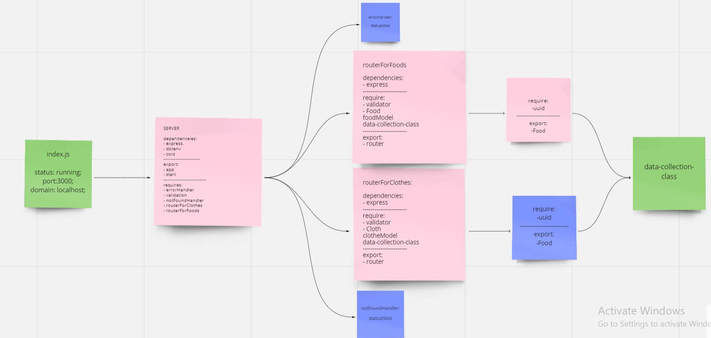

# api-server

## part(1): LAB-4: Data Modeling

## description

- Build a REST API using Express, by creating a proper series of endpoints that perform CRUD operations on a Mongo Database, using the REST standard.

- Create the in-memory data models for Mongo database  models(clothes, foods). And Define the field (type, price) 

- Create a Collection Class that accepts a Mongoose Model into the constructor and assigns it as this.model
This class should have the following methods defined, to perform CRUD Operations
Each method should in turn call the appropriate Mongoose method for the model: create(), get(), read(), update(),delete()

- create a route module for each of the data models. 

- Within the router module create REST route handlers to  calls the correct CRUD method:
1- Add a record(POST)
2- Get All Records(GET)
3- Update A Record(PUT)
4- Delete A Record(DELETE)

## part(2): LAB-9: refactoring using (SQL):

refactoring part(1) insted of using mongodb we will use SQL

## basic-express-server

Heroku app link:

https://sql-server-batool.herokuapp.com
https://sql-server-batool.herokuapp.com/api/v1/food

GitHub actions link:

https://github.com/Batoolayyad/api-server/actions

Pull Rrequest link:

PART(1):
https://github.com/Batoolayyad/api-server/pull/1

PART(2):
https://github.com/Batoolayyad/api-server/pull/2

## UML

